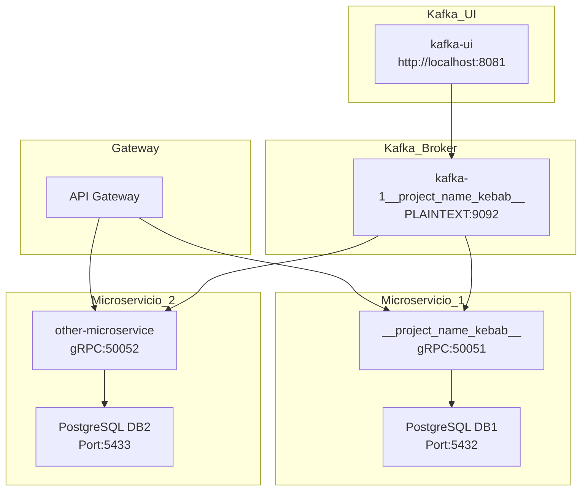

# 🚀 4. Despliegue del microservicio

Este documento define cómo levantar, detener y configurar el entorno completo para ejecutar el microservicio `__project_name_kebab__`.

## 🌐 Servicios involucrados en el despliegue

El entorno está compuesto por:

| Servicio                          | Descripción                                    | Puerto por defecto                    |
| --------------------------------- | ---------------------------------------------- | ------------------------------------- |
| `postgres-__project_name_kebab__` | Base de datos PostgreSQL persistente           | `5432`                                |
| `kafka-1__project_name_kebab__`   | Broker de Kafka                                | `9092` (cliente), `9093` (controller) |
| `kafka-ui`                        | Interfaz gráfica para monitorear tópicos Kafka | `8081`                                |
| `__project_name_kebab__-prod`     | Microservicio principal en modo producción     | `3000` HTTP, `50051` gRPC             |

Todos los servicios se conectan entre sí mediante redes Docker definidas como `bridge`.

---

## 📂 Estructura de los `docker-compose.yml`

```text
docker/
├── postgresql-__project_name_kebab__/
│   └── docker-compose.yml            → PostgreSQL
├── kafka-__project_name_kebab__/
│   └── docker-compose.yml            → Broker Kafka
├── kafka-ui/
│   └── docker-compose.yml            → UI Kafka
apps/
└── __project_name_kebab__/
    └── docker-compose.yml            → Despliegue del microservicio
```

## 🔧 Variables de entorno relevantes

Todas las variables son leídas desde el archivo:

```bash
apps/__project_name_kebab__/.env
```

Variables clave:

| Variable                                  | Descripción                                 | Ejemplo valor                         |
| ----------------------------------------- | ------------------------------------------- | ------------------------------------- |
| `__project_name_screaming___SERVICE_PORT` | Puerto expuesto por el microservicio (HTTP) | `3000`                                |
| `__project_name_screaming___GRPC_PORT`    | Puerto gRPC                                 | `50051`                               |
| `__project_name_screaming___DATABASE_URL` | URL de conexión PostgreSQL para Prisma      | `postgresql://...`                    |
| `KAFKA_BROKERS`                           | Brokers Kafka disponibles                   | `kafka-1__project_name_kebab__:9092`  |
| `KAFKA_CLIENT_ID`, `KAFKA_GROUP_ID`       | Identificadores para Kafka                  | `__project_name_camel__-microservice` |

## 📦 Comandos disponibles (`package.json`)

Se utilizan comandos npm personalizados para facilitar el despliegue:

| Comando                                     | Descripción                                                      |
| ------------------------------------------- | ---------------------------------------------------------------- |
| `npm run __project_name_camel__:up`         | Levanta solo el microservicio                                    |
| `npm run __project_name_camel__:down`       | Detiene solo el microservicio                                    |
| `npm run __project_name_camel__:db:up`      | Levanta solo PostgreSQL                                          |
| `npm run __project_name_camel__:db:down`    | Detiene solo PostgreSQL                                          |
| `npm run __project_name_camel__:kafka:up`   | Levanta solo Kafka                                               |
| `npm run __project_name_camel__:kafka:down` | Detiene solo Kafka                                               |
| `npm run kafka-ui:up`                       | Levanta Kafka UI                                                 |
| `npm run kafka-ui:down`                     | Detiene Kafka UI                                                 |
| `npm run __project_name_camel__:up:all`     | 🔄 Levanta toda la red completa (DB + Kafka + UI + Microservicio) |
| `npm run __project_name_camel__:down:all`   | 🔻 Detiene todo el entorno completo                               |

## 🌐 Red de Docker resultante



> Todas las redes Docker están nombradas explícitamente y conectan los servicios mediante `bridge`. No se usa host networking.


## 🚨 Consideraciones

* El microservicio utiliza `HEALTHCHECK` vía `netcat` para exponer readiness HTTP en el puerto configurado (`SERVICE_PORT`).

* Puedes verificar que los puertos estén expuestos localmente:

  ```bash
  lsof -i :3000
  lsof -i :50051
  ```


## ✅ Flujo recomendado para levantar todo

```bash
npm run __project_name_camel__:up:all
```

1. Se levanta la base de datos PostgreSQL
2. Se levanta Kafka y Kafka UI
3. Se levanta el microservicio con Prisma y gRPC compilado

Para detener todo:

```bash
npm run __project_name_camel__:down:all
```